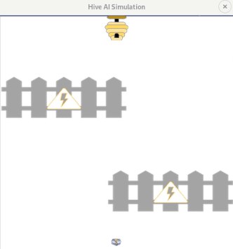
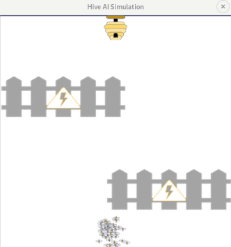
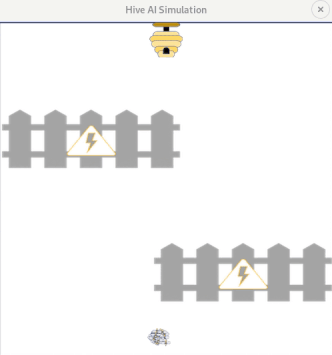

# Beehive AI: Project Overview  
* My first Python project based off the Smart Dots Genetic Algorithm tutorial by Code Bullet  
* Beehive AI is a Python version using bees instead of dots  
* Each generation of bees "evolve" through a genetic algorithm to successfully path to the beehive  
* To run, use "$ python3 hivesim.py"  

## Requirements
**Python Version:** 3.7.0  
**Packages:** PyGame (v1.9.4)

## Demo
### First generations:  

  

### Intermediate generations:  

  

### Last generations:  

  
